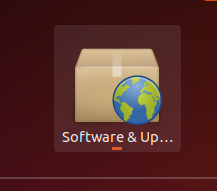
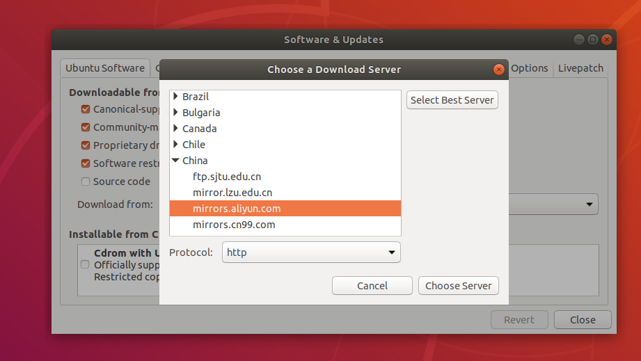
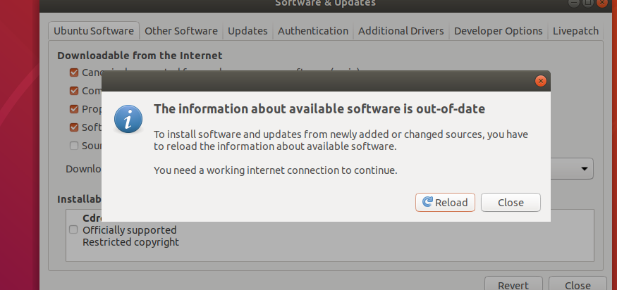
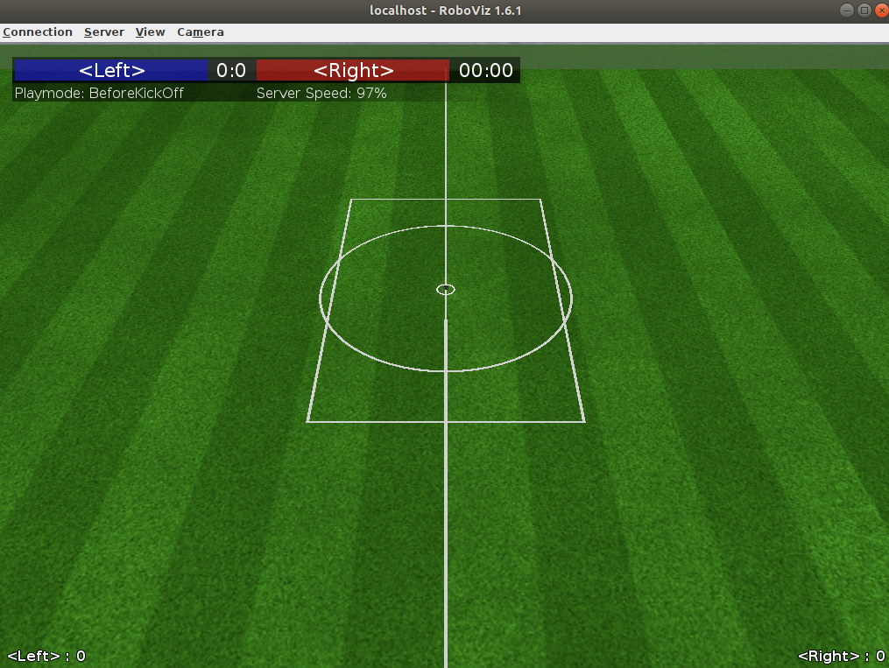

# Robocup 3D simulation 平台下载与安装

RoboCup 3D仿真模拟平台简易安装教程

---

## 安装条件

1. Ubuntu 18.04 LTS 虚拟机或者物理机已经安装完成并可进入桌面。(对于熟悉Linux发行版的同学，随便用什么系统都行)
2. 你的电脑已经接入网络。

## 步骤

### 1. 更换软件源

进入虚拟机桌面，按Win键，找到如下这个软件，单击打开。


更换软件源，选择服务器在中国的软件源，我倾向于阿里云。


遇到这个窗口，点击哪个都可以。


### 2. 一键安装

如果你遇到系统要求软件更新，可以更新，也可以不更新。但请注意，**请更新完成之后再进行下面的安装。不要在安装过程中进行软件更新。**

在终端中运行以下命令，然后耐心等待安装完成即可。笔记本用户记得将笔记本插电，可加快编译速度。

```sh
wget -O- https://gitee.com/doot/Robocup3dInstaller/raw/gitee/ins.sh | sh
```

### 3. 验证安装

打开终端，运行命令`rcsoccersim3d`，若弹出以下界面，则说明安装成功。


---

work by d0ot@github.com
