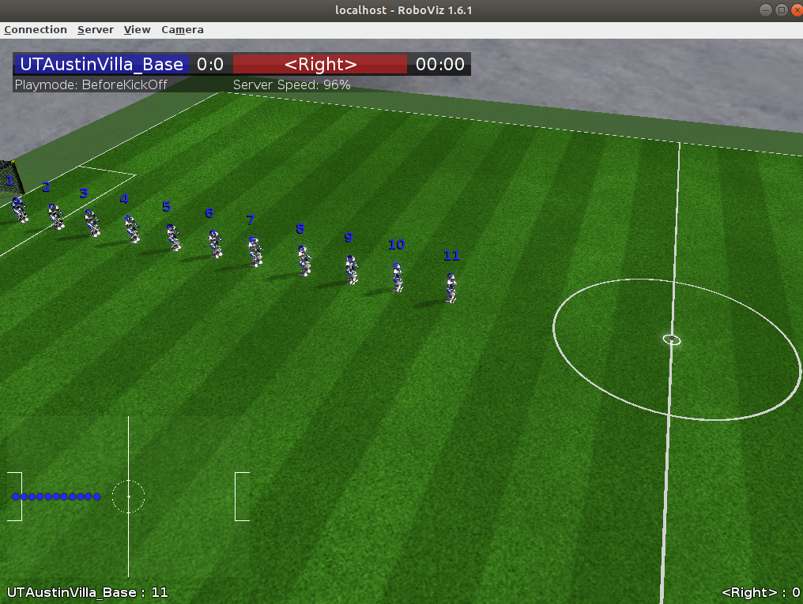

# 球队开发入门指南

本篇教程非常简单。将会一步一步教你如何运行球队底层代码的Demo，不会涉及到具体的代码实现细节。

## 开始之前

1. 安装有Ubuntu的虚拟机或者物理机。虚拟机的安装请参考文档`vminstall`
2. 已经安装RoboCup3D仿真平台。安装平台请参考文档`rcssserver3d`
3. 熟悉简单的Ubuntu系统下的操作。了解如何在Ubuntu下面进行文件的编辑。了解Ubuntu下的终端命令。
4. VSCode已经安装。未安装请到[VSCode](https://code.visualstudio.com/)下载，使用Ubuntu的同学下载Linux64位版本deb包。下载完成后直接双击安装即可。

---

## 运行球队Demo

为了教程的简单性，下面的一些做法可能并不是**Best Practice**，但是这不影响平台和球队的运行。

在Ubuntu桌面，Ctrl + Alt + T打开终端(Terminal)

输入以下指令，Clone一份球队底层代码

```sh
mkdir robocup3d
cd robocup3d
git clone https://gitee.com/doot/utaustinvilla3d
```

启动VSCode，打开刚才我们Clone到的仓库文件夹。


我们可以看到如下界面，注意打开的文件夹位置。(核对左侧文件夹)


Ctrl + `(Tab上面的那个按键) 打开VSCode自带的终端


在VSCode终端中输入以下指令

```sh
cmake .
make -j2
```

`j`后面的数字表示编译所使用的核心数量，核心数越多，编译速度越快，但是在虚拟机中，核心数过高会可能出现编译器内部错误(ICE)。建议设置为2

等待编译完成。我们看可以在VSCode中的终端中看到如下内容。


> Built taget agentspark

看到这里说明编译完成。

打开一个系统终端，输入

```sh
rcsoccersim3d
```

等待这个窗口出现:


随后回到vscode的终端中，输入

```sh
./start.sh
```

等待脚本运行完成，拉动Roboviz视角，可以看到如下界面



### 注意

如果你使用的是VMWare Workstation Pro，并且采用一键安装脚本，这里的渲染可能有BUG(在我的机器上是这样，别的没有测试)，场上物体的渲染**不正常**。但是在足球仿真模拟上面**没有问题**(只是显示问题)。可以暂时凑合使用。似乎是因为OpenJDK在VMWare Workstation Pro中Ubuntu上面与Oracle JDK的行为不完全一致。如果你想解决这个问题，有两个方案。

1. 在物理机上安装Ubuntu。
2. 卸载OpenJDK，安装Oracle JDK。(这里就不展开了，如果有人需要这样，在群里面问就好了)

**不解决也完全能用**，以后做真正的开发肯定是在物理机上进行的，现在使用虚拟机是为了学习，同时也是避免了安装双系统的麻烦与新手安装双系统的危险。

回到正题，在Roboviz取得焦点时，按k开球。

稍等一会你会看到如下的场景：


这就是球队的Demo。
