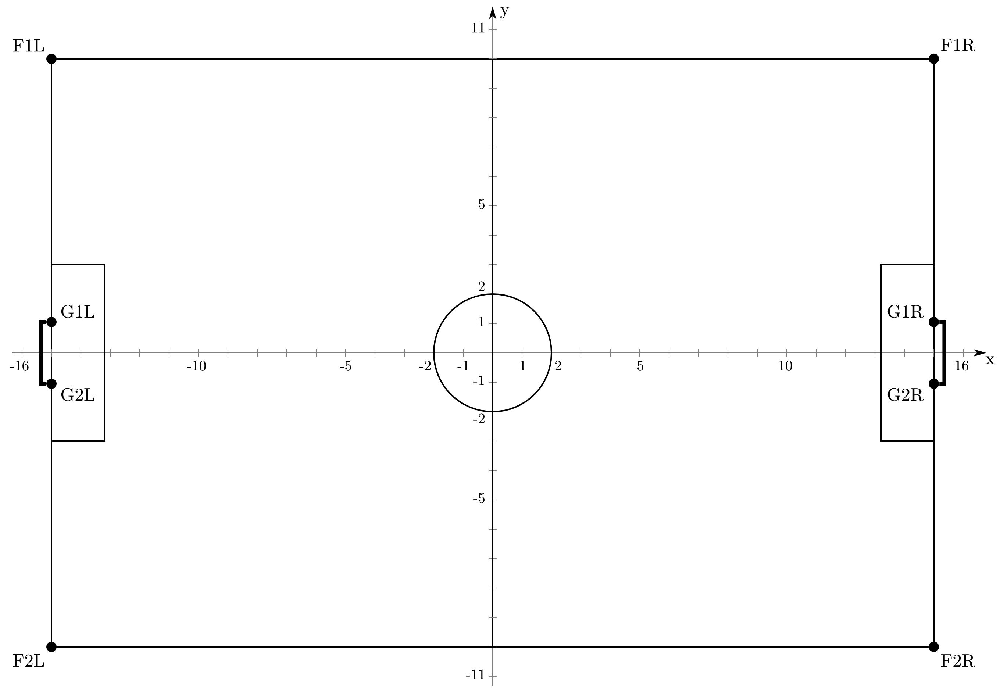

# 球队开发入门指南2

---

## 前置条件

1. 对C++有一定了解。
2. 平台和球队Demo已经可以运行。

---

## 基础概念讲解

该部分将对平台上的基础概念和模拟过程进行讲解。

RoboCup 3D足球模拟采用C/S架构模式。模拟平台作为服务器(Server)，球员作为客户端(Client)，客户端通过TCP连接到服务器上，双方在每个模拟周期中(目前被设置为0.02S)相互发送消息来进行通讯。双方使用S-Expression作为底层通讯数据的格式。客户端也被称作智能体(Agent)

服务器端负责进行物理效果的模拟，足球规则的应用。服务器会把场上的各种物理信息以及机器人自身的状态发送给客户端。客户端收到这些消息，对这些消息进行处理，进行决策，这些信息的处理与决策就是我们要编程的部分。通过我们编写程序，客户端对场上的各种变化做出反应，这些“反应“会以一定的形式发送给服务器。服务器根据每个机器人的反应来进行物理演算，计算出下一个模拟周期的物理状态，再次讲这些状态发送给球员，以此往复。

在一支队伍中每个球员都会有一个球员编号`unique number`(简写为`unum`)，范围为1-11。也就是说，一支队伍会有十一名球员。

球场的大小如图所示：



这一部分内容更多请参考群内`官方相关文档`文件夹下文档。也可参考群公告中的simspark项目wiki页面。入门开发并不过多考虑这些底层内容。

## 找到Demo的实现

在`behaviors/strategy.cc`，你会看到:

```cpp
SkillType NaoBehavior::demoKickingCircle() {
    // ......
    // 具体内容省略
}
```

这里就是我们所运行出来的demo的实现部分。大家可以自己看一下大致的逻辑，本篇文章不会讲解该Demo。

## 编写简单的Demo

**注意**，以下做法并非`Best Practice`。较为正确的做法是建立新的继承自`NaoBehavior`的类，并重写相关虚函数，并在`main.cc`中添加命令行参数相关接口。本着简单原则，本篇采用较为简单的方式。

首先在`behaviors/naobehavior.h`的`NaoBehavior`里面加入成员函数的声明，找到这一行：

```cpp
SkillType demoKickingCircle();
```

在下面添加一行，就变成了

```cpp
SkillType demoKickingCircle();
SkillType demoKicking();
```

找到`behaviors/naobehavor.cc`，加入`demoKicking()`的定义。

```cpp
SkillType NaoBehavior::demoKicking()
{
    if (worldModel->getPlayMode() == PM_PLAY_ON && worldModel->getUNum() == 11)
    {
        return kickBall(KICK_FORWARD, VecPosition(HALF_FIELD_X, 0, 0));
    }
    return SKILL_STAND;
}
```

然后在`behaviors/strategy.cc`的文件中，吧`selectSkill()`的返回语句改为：

```cpp
// return demoKickingCicrcle();
return demoKicking();
```

现在我们重新构建一下。

命令行中输入

```sh
cmake .
make -j2
```

等待构建完成。

随后运行平台，运行`start.sh`，在监视器窗口中按o键打开模式切换，切换模式到`PlayOn`，随后我们会发现0-10号机器人会原地不动，11号机器人会去一直向x轴正方向踢球，直到进球。

### 下面将逐句讲解内容

```cpp
if (worldModel->getPlayMode() == PM_PLAY_ON && worldModel->getUNum() == 11)
```
该句判断当前的模式以及球员编号。如果模式为`PlayON`而且球员为11号，那么

```cpp
return kickBall(KICK_FORWARD, VecPosition(HALF_FIELD_X, 0, 0));
```

就调用`KickBall()`函数(必须使用`KickBall()`的返回值作为`demoKicking()`的返回值)，第一个参数为踢球类型，第二个参数为踢向的方向。

```cpp
return SKILL_STAND;
```
最后对于不满足这两个条件的球员，返回一个简单的`SKILL_STAND`来站立不动。

---

## VSCode使用建议

建议安装`C/C++`插件，可以实现自动补全、符号查找、引用查找等功能。


