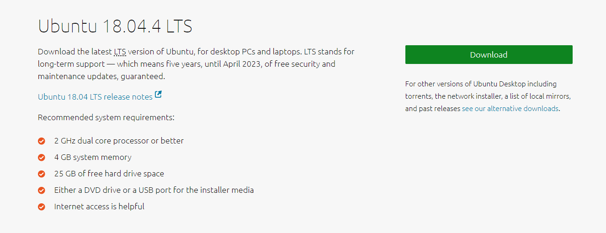
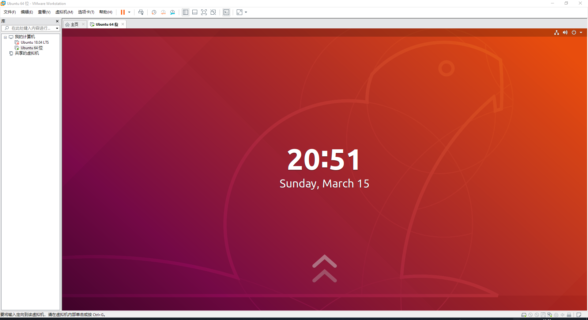
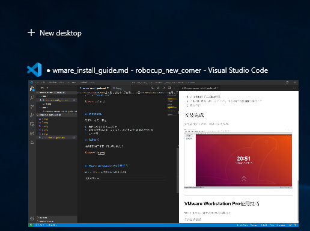
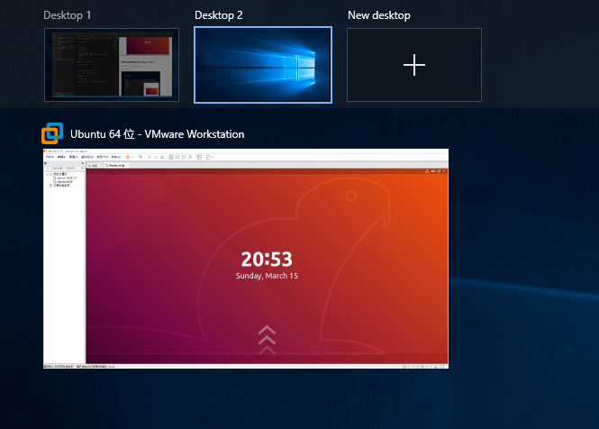
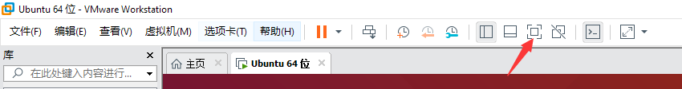
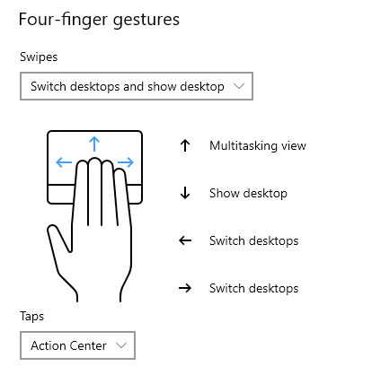
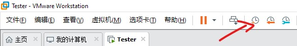

# VMware Workstatioin Pro & Ubuntu18.04LTS虚拟机 安装指南以及使用技巧

## 说在前面：有什么问题在群里问就好了

VMware Workstation Pro 是一款商业虚拟机软件，类似的替代品有VirtualBox。VMware Workstation Pro 和 VirtualBox 选一个用就好。

Ubuntu18.04 LTS 为Robcup3D仿真的推荐平台。

## 我们的目的

进入Ubuntu系统的桌面。

---

## VMware Workstation Pro 下载

[下载链接](https://www.vmware.com/products/workstation-pro/workstation-pro-evaluation.html)

https://www.vmware.com/products/workstation-pro/workstation-pro-evaluation.html

---

## VMware Workstation Pro 安装 & 破解

1. 双击打开，选择安装路径,下一步....
2. **安装完成后，输入密钥(key)，随便从下面选一个填进去就行**

UG5J2-0ME12-M89WY-NPWXX-WQH88

GA590-86Y05-4806Y-X4PEE-ZV8E0

YA18K-0WY8P-H85DY-L4NZG-X7RAD

UA5DR-2ZD4H-089FY-6YQ5T-YPRX6

B806Y-86Y05-GA590-X4PEE-ZV8E0

ZF582-0NW5N-H8D2P-0XZEE-Z22VA

---

## Ubuntu18.04 LTS 系统镜像下载

[下载链接](https://ubuntu.com/download/desktop)

https://ubuntu.com/download/desktop

记得下载**18.04 LTS**

---

## 创建虚拟机

很简单，有几个要点：

1. 选择我们刚下载的iso镜像
2. 虚拟机位置会占用一定的空间，请至少留出20GiB的硬盘空间
3. 建议多给虚拟机分配些cpu核心数量，cpu核心数太少，虚拟机会很慢
4. 耐心等待

## 安装完成

如果看到如下界面，则说明安装成功，鼠标上滑动。

---

## VMware Workstation Pro使用技巧

### 快速切换桌面

Win + Tab 可以打开Window的虚拟桌面

创建新的桌面，如图

把VMware Workstation Pro窗口拖入新的桌面

并将其全屏

然后就可以用四指左右滑动触摸板来切换两个系统的桌面啦

### 创建系统快照

>什么是快照？
快照是虚拟机软件对整个虚拟机操作系统的状态的保存。

举个例子：
我们可以在安装完成系统之后，保存一份快照。如果我们在后面的操作中出现什么错误，我们就可以回到保存快照的地方。

下图所示三个按钮为快照相关。

---

work by d0ot@github.com
